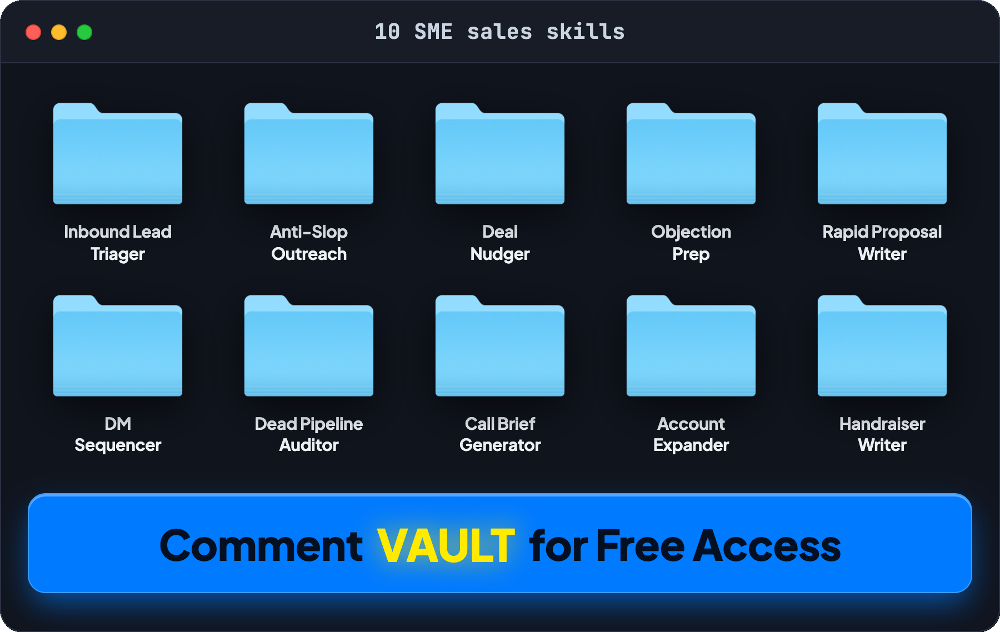

# 10 SME Sales & Pipeline Skills Vault



> **A modular suite of 10 production-ready agent skills designed to lift SME baseline sales by up to 30% at a 95% profit margin without hiring additional reps.**

Most SME operators treat AI sales like a blank chat box. One generic prompt. One uninspired rewrite. No handoff between lead qualification, follow-ups, and CRM updates. Leads drop through the cracks because the handoffs are manual.

This vault packages the entire sales engine into 10 modular, interoperable skills built for any AI agent that reads `SKILL.md` (Claude, Antigravity, Cursor, OpenAI Agents).

---

## The 10 Skills

| # | Skill | Directory | Primary Outcome |
|---|---|---|---|
| **01** | **Inbound Lead Triager** | [`skills/inbound-lead-triager`](skills/inbound-lead-triager/SKILL.md) | Scores buyer intent and routes hot leads in under 60 seconds. |
| **02** | **Anti-Slop Outreach** | [`skills/anti-slop-outreach`](skills/anti-slop-outreach/SKILL.md) | Researches prospect receipts and writes cold outreach that sounds human. |
| **03** | **Deal Nudger** | [`skills/deal-nudger`](skills/deal-nudger/SKILL.md) | Multi-touch follow-up cadences that revive stalled conversations. |
| **04** | **Objection Prep** | [`skills/objection-prep`](skills/objection-prep/SKILL.md) | Battle-tested talking points for pricing, timing, and DIY pushback. |
| **05** | **Rapid Proposal Writer** | [`skills/rapid-proposal-writer`](skills/rapid-proposal-writer/SKILL.md) | Turns discovery notes into clean, 1-page scoped proposals in 3 minutes. |
| **06** | **DM Sequencer** | [`skills/dm-sequencer`](skills/dm-sequencer/SKILL.md) | Executes high-converting LinkedIn touchpoints without sounding automated. |
| **07** | **Dead Pipeline Auditor** | [`skills/dead-pipeline-auditor`](skills/dead-pipeline-auditor/SKILL.md) | Scans dormant CRM accounts to find quick re-open opportunities. |
| **08** | **Call Brief Generator** | [`skills/call-brief-generator`](skills/call-brief-generator/SKILL.md) | Pulls prospect pain points and financial leverage before sales calls. |
| **09** | **Account Expander** | [`skills/account-expander`](skills/account-expander/SKILL.md) | Identifies upsell triggers and expansion paths on active clients. |
| **10** | **Handraiser Writer** | [`skills/handraiser-writer`](skills/handraiser-writer/SKILL.md) | Crafts organic social posts that pull qualified buyer DMs. |

---

## How to Load and Use These Skills

### 1. Claude Code / Antigravity / Cursor
Place the relevant skill folder inside your project's `.agents/skills/` directory:
```bash
cp -r skills/inbound-lead-triager path/to/your/project/.agents/skills/
```

### 2. Claude Desktop / Web (Projects)
1. Open your **Claude Project**.
2. Upload the desired `SKILL.md` file directly into **Project Knowledge**.
3. Instruct Claude to follow the skill rules for your tasks.

### 3. n8n / Zapier Automation Pipelines
Point your webhook payloads directly into an LLM node conditioned with the skill's workflow and scoring rubric for automated real-time triage.

---

## Core Philosophy: Anti-Slop & Evidence-First

Every skill in this vault follows strict anti-slop rules:
- **No generic AI fluff**: Banned words (`delve`, `seamless`, `game-changer`, `harness`, `elevate`) are strictly prohibited.
- **Evidence-First**: Numbers and mechanisms before claims.
- **Frictionless Handoffs**: Structured JSON and clear markdown handoffs between skills.

---

## License

MIT License. Free to use, adapt, and deploy.
