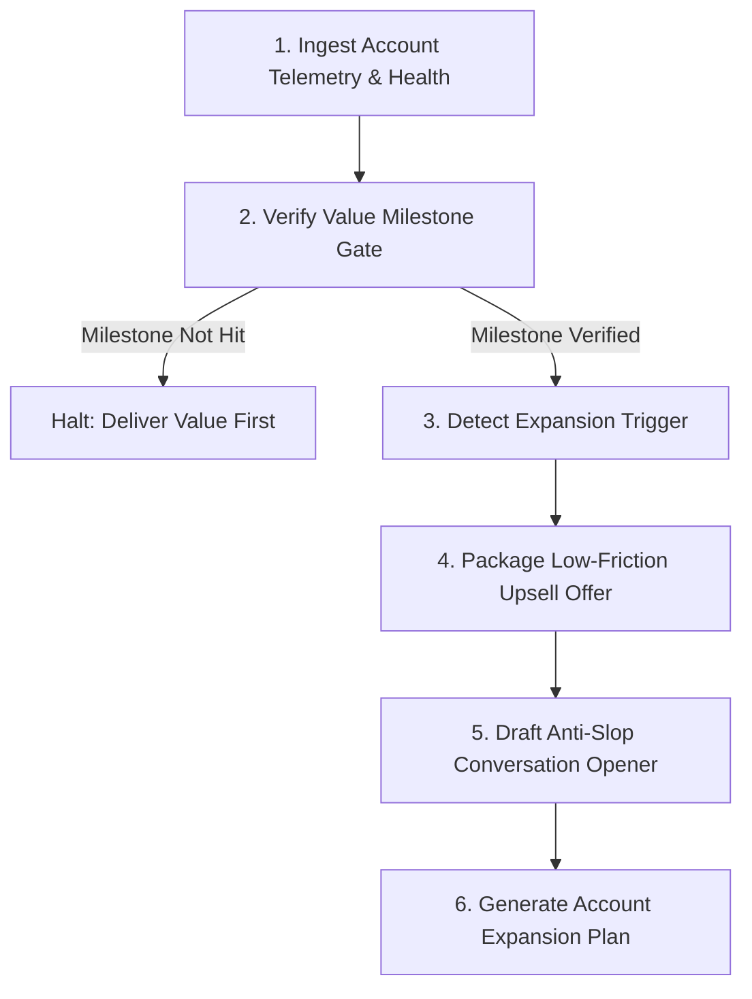

# Account Expander

Monitors active, paying SME accounts for expansion triggers and drafts frictionless upsell offers. Retaining and growing existing clients costs 5x less than landing new logos. This skill ensures expansions happen only after verified value milestones, preventing premature pitches that damage client trust.

---

## Workflow



### Step 1: Ingest Account Telemetry & Health
Collect active client data:
- Current monthly/annual spend, contract renewal date, services or tier active.
- Usage metrics (seats filled, API volume, hours used, tickets logged).
- Qualitative sentiment (NPS score, Slack channel responsiveness, executive quotes).

### Step 2: Verify Value Milestone Gate (Mandatory)
Never pitch an upsell to a client who has not achieved their initial success metric. Check against the gate:
- Did the client achieve their agreed Day-30 or Day-60 outcome? (e.g., first 10 qualified leads generated, system deployed with zero downtime, first 50 hours saved).
- If NO: Halt expansion. Route task to Customer Success to secure the baseline win first.
- If YES: Proceed to trigger detection.

### Step 3: Detect Expansion Trigger
Identify one of three primary expansion vectors:
1. **Value Milestone Met**: Client hit or exceeded target KPI (e.g., achieved 120% of pipeline goal, ROI reached 4x spend).
2. **Capacity Threshold Hit**: Client reached 80%+ of plan limits (seats, storage, API credits, sprint hours, monthly throughput).
3. **Organizational Shift**: Client hired new leaders, raised capital, launched a new product line, or expanded into a new territory.

### Step 4: Package Low-Friction Upsell Offer
Select the expansion model with the lowest switching friction:
- **Offer 1: The Department Clone** (Replicate the winning system in a sibling department).
- **Offer 2: The Volume Pre-Buy / Tier Lock** (Protect them from overage fees before they hit limits).
- **Offer 3: The Done-for-You Lift** (Upgrade from self-serve/software to managed execution).
- **Offer 4: The Speed / Dedicated SLA Tier** (Provide sub-1-hour escalation and direct engineering/strategist access).
- **Offer 5: The Workflow Extension** (Add the upstream or downstream step to the current service).

### Step 5: Draft the Expansion Outreach
Write a direct message (Slack/Email) that frames expansion as risk mitigation, cost savings, or bottleneck removal, never as a sales pitch.

### Step 6: Produce Output Report
Generate the expansion dossier with account health score, trigger evidence, recommended contract terms, and draft copy.

---

## The 3 Expansion Trigger Categories

### 1. Value Milestone Triggers
- **Day 30 Quick Win**: Client successfully launches initial implementation with positive feedback.
- **Measurable ROI Threshold**: Client logs quantified savings or revenue (e.g., "$45k generated on $5k spend").
- **Unsolicited Praise**: Client posts a win in Slack or leaves a positive testimonial.

### 2. Capacity Threshold Triggers
- **Seat Saturation (>= 80%)**: 8 out of 10 purchased seats active daily; new team members requesting logins.
- **Usage / Quota Ceiling (>= 85%)**: Account approaches monthly API credits, data export limits, or sprint hours before mid-month.
- **Bottleneck Migration**: Solving problem A has accelerated their workflow, causing problem B downstream (e.g., lead engine created more leads than their 1 SDR can process).

### 3. Organizational & Strategic Triggers
- **New Department Head Hired**: A new VP of Marketing or Sales joins and wants to standardize tools.
- **Sister Team Request**: Another division asks how the client achieved their recent results.
- **Funding or M&A**: Client secures capital to scale operations rapidly.

---

## The 5 Low-Friction Expansion Offers

### Offer 1: The Department Clone
- **Mechanism**: Take the exact workflow built for Team A and deploy it for Team B with zero net-new onboarding time.
- **Pitch Angle**: "We already mapped out your branding, integrations, and compliance. Deploying this for Support takes 3 days instead of 3 weeks."

### Offer 2: The Volume Pre-Buy (Overage Shield)
- **Mechanism**: Warn the client they are about to incur automatic on-demand overage charges, and offer an early tier bump that lowers their unit cost.
- **Pitch Angle**: "You are pacing to hit 115% of your quota by the 20th. Instead of paying standard 2x overage rates, we can lock in Tier 2 now and credit the difference."

### Offer 3: The Done-for-You Lift
- **Mechanism**: When software or self-serve clients lag on implementation due to lack of internal bandwidth, step in with turnkey execution.
- **Pitch Angle**: "Your team loves the software but is bottlenecked on building templates. We can take over buildout and maintenance for $X/mo so your team just reviews output."

### Offer 4: The Speed / Dedicated SLA Tier
- **Mechanism**: Offer dedicated support channels (Slack/Teams), guaranteed 30-minute turnarounds, or weekend coverage for mission-critical operations.
- **Pitch Angle**: "As your volume scaled past 10k users, your team needs faster issue resolution. We can open a direct private Slack with our senior engineers."

### Offer 5: The Workflow Extension (Upstream/Downstream)
- **Mechanism**: Expand from handling one isolated step to the preceding or succeeding step in their pipeline.
- **Pitch Angle**: "We handle your inbound qualification. The bottleneck is now SDR outreach speed. We can plug our booking agent directly into your calendar."

---

## Anti-Slop Rules for Account Expansions

1. **Ban Corporate Upsell Speak**:
   - Never use: *"Synergies"*, *"Holistic solution"*, *"Elevate our partnership"*, *"Unlock value"*, *"Deepen our relationship"*, *"Next-level capabilities"*.
   - Replace with: Concrete throughput numbers, specific hour savings, exact dollar figures.
2. **No Vendor Greed Framing**:
   - Never say: *"We have a special promo this quarter"*, *"Our sales quota"*, *"We'd love to sell you more seats"*.
   - Frame expansion entirely around **their** capacity, risk, and unit economics.
3. **Receipts First**:
   - The first sentence must reference an undeniable, verifiable metric the client achieved under the current plan.
4. **Zero-Risk Transition**:
   - Offer a prorated pilot or a 30-day exit clause for the expanded scope.

---

## Working Before & After Examples

### Example 1: Capacity Threshold (85% Seat & Credit Saturation)

#### Before (Slop)
> Subject: Maximizing your subscription potential with CloudScale!
>
> Dear Kevin,
>
> I hope this email finds you well and having a productive week!
>
> I was reviewing your account activity and noticed that your team has been getting incredible value from our platform. You are currently utilizing over 85% of your monthly API allocation.
>
> To ensure that your business processes remain seamless and unhindered by platform constraints, we would love to discuss upgrading your organization to our Enterprise tier. This tier unlocks unlimited potential and provides holistic synergy across your tech stack.
>
> Do you have 15 minutes this Wednesday to discuss how we can partner on this growth journey?
>
> Warm regards,
> Samantha

#### After (Account Expander)
> Slack to Kevin:
>
> Hey Kevin, quick heads-up on usage:
>
> Your team burned through 86,000 of your 100,000 data credits this month with 9 days left on the billing cycle.
>
> At this pace, on-demand overage will add about $640 to this month's invoice ($0.04/credit).
>
> If you want, we can bump you to the 250k tier starting today. Drops unit cost to $0.015/credit and saves you around $380 this month alone.
>
> Want me to make that swap, or prefer to cap queries for the next 9 days?

---

### Example 2: Department Clone (Expanding from Outbound to Customer Success)

#### Before (Slop)
> Subject: Expanding our horizons together
>
> Hi Elena,
>
> Congratulations on the fantastic results your outbound team has experienced using our AI automation workflows! It has truly been a pleasure witnessing your growth.
>
> Since our solution has proven so impactful for your SDR team, we believe there is tremendous synergy to be tapped by introducing our platform to your Customer Success department as well. We offer a comprehensive suite of features designed to elevate client retention and empower CSMs.
>
> Can we schedule a brief 20-minute alignment call with you and your VP of CS to explore this opportunity?
>
> Best,
> Michael

#### After (Account Expander)
> Slack / Email to Elena:
>
> Hey Elena,
>
> Outbound campaign wrapped last Friday at 42 booked calls ($180k pipeline generated against the $4k spend).
>
> When we spoke last week, you mentioned your CSMs are drowning in manual onboarding check-ins for all those new accounts.
>
> We can clone the exact intake and scheduling agent we built for outbound and point it at newly closed accounts. Onboarding setup would take 4 days since your CRM and Slack webhooks are already connected.
>
> Want me to draft a 1-page scope and price for the CS team?

---

### Example 3: Done-For-You Workflow Upgrade (Agency / Dev Services)

#### Before (Slop)
> Subject: Premium Dedicated Management Opportunity
>
> Hello Marcus,
>
> I hope you're having an awesome quarter!
>
> We love seeing you build with our developer SDK. However, we've noticed your team has submitted several high-priority support tickets regarding deployment bottlenecks over the past two weeks.
>
> To elevate your operational efficiency, we'd like to invite you to join our VIP Managed Engineering tier. This premium tier provides white-glove engineering support that seamlessly resolves all your technical hurdles.
>
> Let's hop on a call to review the pricing and features. How does tomorrow at 11 AM look?
>
> Cheers,
> Brandon

#### After (Account Expander)
> Email to Marcus:
>
> Hey Marcus,
>
> Noticed your team logged 4 tickets last week troubleshooting webhook timeout errors on the custom Shopify sync.
>
> Your devs shouldn't be burning 10+ hours debugging infrastructure when they need to be shipping core features.
>
> We can take over hosting, error monitoring, and maintenance of those 3 middleware scripts for a flat $1,200/mo. We guarantee 99.9% uptime and handle bug fixes within 2 hours.
>
> If that takes the headache off your plate, I can turn it on starting Monday. Let me know what you think.

---

## Output Schema

When auditing an active account for expansion, generate this dossier:

```markdown
### Account Expansion Audit: [Client Name]
- **Current MRR / ARR**: $[Amount]
- **Plan / Scope**: [Current tier / active services]
- **Value Milestone Status**: [Verified: Specific KPI reached / Not yet hit]
- **Primary Expansion Trigger**: [Capacity / Department Clone / Workflow / SLA]
- **Trigger Evidence**: [Exact metric, e.g., 92% quota utilized, 38 leads generated]

#### Recommended Expansion Package
- **Offer Archetype**: [e.g., The Volume Pre-Buy / The Department Clone]
- **Proposed Terms**: [New tier, pricing delta, term]
- **Risk Reversal**: [e.g., 30-day prorated cancellation]

#### Proposed Outreach
**Channel**: [Shared Slack Channel / Email]
**Message**:
> [Exact message text following anti-slop rules]
```
