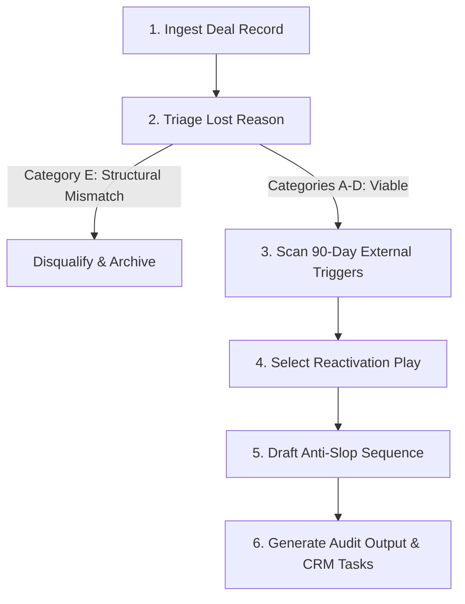

# Dead Pipeline Auditor

Reactivates dormant CRM opportunities and closed-lost deals. Deals stalled 60 to 360 days ago represent prepaid customer acquisition cost. This skill audits lost records, filters out structural mismatches, identifies high-leverage timing triggers, and generates zero-slop re-opening outreach.

---

## Workflow



### Step 1: Ingest Deal Record
Extract raw deal history from CRM export, CSV, or sales notes:
- Account name, primary contact name, title, email, LinkedIn URL.
- Original deal value, product/service discussed, close-lost date (target: 60–365 days prior).
- Last known status, recorded lost reason, meeting notes, competitor chosen (if any).

### Step 2: Triage Lost Reason
Categorize the deal into one of five lost buckets:
1. **Category A: Budget Freeze / Bad Timing.** Deal halted due to quarter-end freezes, re-org, or competing priorities. High viability (40–60% re-open rate).
2. **Category B: Chose Competitor.** Selected a rival tool/agency. Moderate-high viability (30–45% re-open rate at 90–180 days due to implementation buyer's remorse).
3. **Category C: Feature or Scope Gap.** Dropped because of a missing integration, capacity ceiling, or custom requirement. High viability if the gap is now closed (50%+ re-open rate).
4. **Category D: Ghosted / No Decision.** Prospect stalled after proposal or demo without formal rejection. Moderate viability (25–35% re-open rate).
5. **Category E: Bad Fit / Economically Unviable.** Wrong ICP, zero budget, toxic requirements, non-payment history. Disqualify immediately. Do not reactivate.

### Step 3: Scan 90-Day External Triggers
Check for changes that occurred since the deal went cold:
1. **Champion movement**: Point of contact promoted or moved to a new company; new VP/Director hired in their department.
2. **Contract renewal window**: Competitor contracts signed 9–12 months ago up for review, or 90 days past rollout when onboarding pain peaks.
3. **Company expansion**: New funding round, aggressive hiring in relevant department, or new office opening.
4. **Tech stack change**: New tools detected via job posts or BuiltWith/Wappalyzer.
5. **Product / capability upgrade**: Your team shipped the missing feature, integration, or SLA requested during original sales cycle.

### Step 4: Select Reactivation Play
Match the triage category and active trigger to a dedicated messaging angle:
- **Play 1: The 9-Word Reset** (Best for Ghosted & Timing deals).
- **Play 2: The Competitor Buyer's Remorse Probe** (Best for Competitor deals at 90–120 days).
- **Play 3: The Gap Closure Notice** (Best for Feature/Scope gap deals).
- **Play 4: The New Leadership Fresh Slate** (Best when a new decision-maker joins).
- **Play 5: The Micro-Asset Value Drop** (Best for uncommitted or cautious accounts).

### Step 5: Draft Reactivation Sequence
Generate a 2-touch sequence (Touch 1: Email/LinkedIn; Touch 2 at Day 4: Short follow-up thread). Adhere strictly to the anti-slop rules below.

### Step 6: Produce Output Report
Return the audited deal profile, trigger analysis, score (0–100), and copy ready to paste into outreach tools.

---

## The 5 Reactivation Plays

### Play 1: The 9-Word Reset
- **When to use**: Deals dead 60–180 days with no negative feedback, ghosted after quote, or frozen on timing.
- **Mechanism**: Strips away all sales pressure. Asks a single binary question that requires minimal cognitive energy to answer.
- **Formula**:
  > Subject: `[first name]` or `[project name]`
  >
  > Hey `[first name]`, are you still looking to `[solve primary problem / achieve outcome]` this quarter?

### Play 2: The Competitor Buyer's Remorse Probe
- **When to use**: Prospect selected a competitor 90–120 days ago. 68% of enterprise/SME software implementations face delay or dissatisfaction in Q1 post-sale.
- **Mechanism**: Validates their choice, removes hostility, and checks if reality matched sales promises without bashing the rival.
- **Formula**:
  > Subject: `[Competitor]` onboarding
  >
  > Hey `[first name]`,
  >
  > You likely finished rolling out `[Competitor]` by now.
  >
  > Curious how the `[specific workflow, e.g., CRM sync / reporting / turnaround]` is holding up under real volume?
  >
  > If it solved everything, glad to hear it. If you're running into the usual `[common competitor limitation, e.g., manual CSV exports]`, happy to share how we patched that for `[Reference Client]`.

### Play 3: The Gap Closure Notice
- **When to use**: Deal was lost specifically due to a missing feature, integration, or capacity constraint that now exists.
- **Mechanism**: Pure evidence of progress. Gives them an immediate reason to re-evaluate without admitting past fault.
- **Formula**:
  > Subject: `[Feature / Integration name]` live
  >
  > Hey `[first name]`,
  >
  > When we spoke in `[Month]`, we paused because we didn't have `[specific integration / capacity / SLA]`.
  >
  > We shipped `[exact feature / capability]` last week. Two clients in `[industry]` are already using it to `[concrete outcome]`.
  >
  > Worth taking a 10-minute look, or is your current setup handling this?

### Play 4: The New Leadership Fresh Slate
- **When to use**: The old point of contact left, or a new VP/Head of department was hired.
- **Mechanism**: Congratulates the new leader, resets the relationship without referencing old stalled baggage, and references historical context.
- **Formula**:
  > Subject: Congrats + `[Department]` priorities
  >
  > Hey `[first name]`,
  >
  > Saw you took over `[Department / Role]` at `[Company]` last month, congrats on the step up.
  >
  > We mapped out an audit of `[Company]'s [specific workflow]` with `[Old Contact Name]` back in `[Month]`. We paused when priorities shifted.
  >
  > Happy to send over the notes and workflow teardown if that saves you ramp time this quarter. Want me to send the PDF?

### Play 5: The Micro-Asset Value Drop
- **When to use**: High-value account ($20k+ ACV) that stalled with broad interest but no urgency.
- **Mechanism**: Sends a bespoke asset (teardown, benchmark calculator, anonymized data point) with zero demand for a meeting.
- **Formula**:
  > Subject: benchmark data for `[Company]`
  >
  > Hey `[first name]`,
  >
  > Ran a benchmark on `[metric, e.g., landing page conversion / outbound reply rates]` across 30 `[industry]` companies last week.
  >
  > `[Company]` sits right around `[estimate]`, while top quartile is hitting `[target]`.
  >
  > Built a 1-page breakdown showing the 2 changes closing that spread. No pitch, just figured your team could use the data. Open to taking a look?

---

## Anti-Slop Rules for Reactivations

Every draft must pass these filters:

1. **Banned Openers**:
   - Never use: *"Hope you're having a great week"*, *"Just checking in"*, *"Circling back"*, *"Touching base"*, *"Bumping this to the top of your inbox"*, *"I know you're busy"*.
   - Replace with: Direct observation, specific receipt, or the binary question.
2. **No Guilt Tripping**:
   - Never say: *"I haven't heard back from you"*, *"Assuming your priorities have changed"*, *"Since you went silent"*.
3. **No Fake Urgency**:
   - Never say: *"Spots are filling up fast"*, *"Our calendar is closing this Friday"*, *"Exclusive opportunity"*.
4. **Length Cap**:
   - Initial reactivation: Under 75 words.
   - Follow-up touch: Under 30 words.
5. **Single Objective**:
   - Every message has one CTA. Ask for interest or a binary confirmation, never a 45-minute demo call right away.

---

## Working Before & After Examples

### Example 1: Budget Freeze / Ghosted Account (SaaS / Agency)

#### Before (Slop)
> Subject: Following up on our previous conversation!
>
> Dear Marcus,
>
> I hope you are having an amazing week so far!
>
> I wanted to circle back and touch base regarding our proposal from November for the automated customer support overhaul. I know how quickly things move in the fast-paced e-commerce landscape, but I wanted to see if the timing is better now for us to reconnect?
>
> We have helped numerous businesses seamlessly elevate their CSAT scores and leverage AI to drive ROI.
>
> Would you have 15-20 minutes this Thursday at 2 PM EST for a quick discovery call to discuss how we can partner together?
>
> Best regards,
> Alex

#### After (Dead Pipeline Auditor)
> Subject: support automation
>
> Hey Marcus,
>
> Are you still looking to cut Zendesk first-response times down under 5 minutes this quarter?
>
> Let me know if this is on the backburner.

---

### Example 2: Lost to Competitor (90 Days Post-Sale)

#### Before (Slop)
> Subject: Checking in on your experience with CompetitorX
>
> Hi Sarah,
>
> Hope all is well with you. I know you ultimately decided to go with CompetitorX for your sales intelligence software back in October. While we were disappointed not to win your business, we respect your decision.
>
> However, many clients find that CompetitorX's data accuracy is not as robust as advertised, leading to lower conversion rates and missed pipeline goals. Our cutting-edge platform provides unparalleled verified mobile numbers that empower your team to crush quota.
>
> I'd love to show you what we've added recently. Can I get 15 minutes on your calendar next Tuesday?
>
> Cheers,
> Dave

#### After (Dead Pipeline Auditor)
> Subject: CompetitorX data quality
>
> Hey Sarah,
>
> You're likely 90 days into CompetitorX by now.
>
> Curious how their EMEA direct-dial connect rates are holding up for your reps?
>
> If your reps are consistently hitting 7%+ pickup rates, ignore me. If they're spending half their day wading through bad switchboard numbers, happy to send over our EMEA benchmark sheet so you can compare.

---

### Example 3: Missing Integration Closed (Fintech / ERP)

#### Before (Slop)
> Subject: Exciting news! We now have NetSuite integration!
>
> Hello Jason,
>
> Hope your quarter is off to a flying start!
>
> I'm thrilled to announce that our engineering team has officially rolled out our brand-new, seamless NetSuite integration! When we last spoke in August, you mentioned that lacking this native connector was a dealbreaker for your finance operations.
>
> Now that we have addressed this hurdle, I would love to hop on a call and demonstrate how this game-changing capability can revolutionize your reconciliation workflow.
>
> Do you have some time later this week?
>
> Warmly,
> Priya

#### After (Dead Pipeline Auditor)
> Subject: netsuite connector live
>
> Hey Jason,
>
> We paused our chat in August because we lacked direct two-way sync with NetSuite.
>
> That connector went live last Tuesday. We just rolled it out for a 45-person logistics team, reconciles transactions every 15 minutes with zero manual CSV imports.
>
> Worth a 5-minute walkthrough, or did you already solve this internally?

---

## Output Schema

When auditing a dormant deal, return this exact format:

```markdown
### Dead Deal Audit: [Company Name]
- **Primary Contact**: [Name, Title]
- **Original Close Date**: [YYYY-MM-DD] ([N] days dormant)
- **Original ACV**: $[Amount]
- **Lost Reason Bucket**: [Category A/B/C/D]
- **Detected External Trigger**: [Specific trigger or "None detected - cold reset"]
- **Reactivation Score**: [0-100] (Calculated from: Days dormant + Trigger strength + Historical rapport)
- **Selected Play**: [Play 1-5]

#### Recommended Outreach
**Channel**: [Email / LinkedIn DM / Phone]
**Subject**: [Subject line]

[Exact message text]

#### Fallback (Touch 2 - Day 4)
[Exact short reply text]
```
