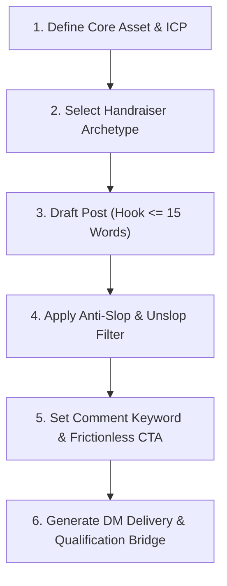

# Handraiser Writer

Creates organic social posts ("handraisers") that exchange a high-value operational asset (teardown, calculator, swipe file, SOP) for buyer comments and private DM conversations. This skill guarantees that content filters for qualified buyers rather than freebie seekers, adheres to strict anti-slop rules, and runs a proven 2-step DM delivery bridge.

---

## Workflow



### Step 1: Define the Core Asset & Target ICP
Identify an asset that solves an immediate, painful operational problem for SME decision-makers:
- **Eligible Assets**: Architecture diagram, benchmark spreadsheet, tested prompt library, n8n workflow JSON, SOP, breakdown teardown.
- **Ineligible Assets**: Generic "Ultimate Guides", vague 30-page ebooks, regurgitated blog posts, motivational PDFs.
- Define who should raise their hand (e.g., Founders scaling past \$1M ARR, Heads of Sales with 3+ SDRs, Agency owners).

### Step 2: Select Handraiser Archetype
Pick one of the four high-performing frameworks:
- **Archetype 1: The Architecture / System Teardown** (Gives away the internal blueprint of a high-value build).
- **Archetype 2: The Contrarian Data Benchmark** (Disproves an industry myth with proprietary test metrics).
- **Archetype 3: The Practitioner Swipe File / Arsenal** (Curates verified, field-tested copy or scripts).
- **Archetype 4: The Plug-and-Play Calculator / Decision Matrix** (Offers an operational tool that calculates financial trade-offs).

### Step 3: Draft the Post
Follow structural constraints:
- **Length**: 80–160 words target, 200 words absolute ceiling.
- **Hook**: 15 words or fewer. Must contain a concrete number, specific system name, or candid admission.
- **Body**: Concrete receipts only. State the mechanism and what it does, not how it feels.
- **CTA**: Single-word comment trigger. No multi-step hoops.

### Step 4: Run the Anti-Slop Audit
Run the draft through the unslop checklist:
- Strip out banned words (`game-changer`, `seamless`, `delve`, `unleash`, `landscape`, `pivotal`).
- Eliminate all em dashes (`—`), parentheses, and colon mid-sentence connectors.
- Delete decorative emojis in headings and body bullets.
- Remove fake vulnerability or artificial "broetry" line spacing.

### Step 5: Configure the Comment Trigger
Select a clean, relevant single-word keyword in uppercase:
- *Good*: `ROUTER`, `AUDIT`, `MATRIX`, `PROMPTS`, `BENCHMARK`.
- *Bad*: "Comment 'I WANT THIS NOW' and tag two friends who love sales".

### Step 6: Draft the DM Delivery Bridge
Write the 2-step DM sequence:
1. **Immediate Delivery**: Deliver the direct link with zero friction (Google Doc/Sheet with "Anyone with link can view").
2. **Contextual Qualification Hook**: Ask one casual question that naturally separates tire-kickers from buyers ready for a project.

---

## The 4 Handraiser Archetypes

### Archetype 1: The Architecture / System Teardown
- **Best for**: Technical founders, agency owners, and workflow engineers selling complex services.
- **Core Mechanism**: Expose the exact technical architecture that competitors hide behind a paywall.
- **Formula**:
  > [Hook: Specific result achieved or mistake prevented]
  >
  > [The Problem: Why traditional setups break at volume]
  >
  > [The Mechanism: The 3-4 components of your actual build]
  >
  > [The Asset Offer: Clean schematic + raw workflow file]
  >
  > [Frictionless CTA: Comment keyword]

### Archetype 2: The Contrarian Data Benchmark
- **Best for**: Consultants and service providers challenging status-quo beliefs.
- **Core Mechanism**: Reveal findings from testing a high volume of data points that contradicts popular guru advice.
- **Formula**:
  > [Hook: Data point proving standard practice failed]
  >
  > [The Test: Exactly what was tested, sample size, and duration]
  >
  > [The Findings: Numbers comparing the standard way vs your way]
  >
  > [The Asset Offer: Raw anonymized benchmark dataset]
  >
  > [Frictionless CTA: Comment keyword]

### Archetype 3: The Practitioner Swipe File / Arsenal
- **Best for**: Outbound agencies, copywriters, and sales consultants.
- **Core Mechanism**: Share a curated library of top-performing assets, stripped of vanity metrics and accompanied by raw response rates.
- **Formula**:
  > [Hook: Quantified volume created + conversion rate]
  >
  > [The Breakdown: What worked, what flopped, and the winning pattern]
  >
  > [The Asset Offer: Uncut Google Doc with templates and context]
  >
  > [Frictionless CTA: Comment keyword]

### Archetype 4: The Plug-and-Play Calculator / Decision Matrix
- **Best for**: Fractional executives, financial advisors, and operational specialists.
- **Core Mechanism**: Solve a difficult financial or resource-allocation calculation that prospects dread doing themselves.
- **Formula**:
  > [Hook: The dollar amount companies burn making the wrong choice]
  >
  > [The Dilemma: Option A vs Option B breakdown]
  >
  > [The Formula: The variables that dictate the right decision]
  >
  > [The Asset Offer: Interactive Google Sheet calculator]
  >
  > [Frictionless CTA: Comment keyword]

---

## Comment Mechanics & Delivery Protocols

### Why Single-Word Comments Win
1. **Algorithmic velocity**: Low-friction comments generate rapid initial engagement that signals viral velocity to the feed.
2. **Mobile conversion**: Mobile users bounce when asked to write full sentences. A single word takes one tap.
3. **Automated extraction**: Clean parsing for automation tools (n8n, Make, Lemlist) with zero false negatives.

### The 2-Step DM Delivery Protocol
Never dump a link without context, and never hold the asset hostage behind a sales call.

- **Step 1: Direct link delivery (within 5 minutes)**:
  Send the asset immediately. Give them view access without requiring an email gate.
- **Step 2: The qualification probe (in the same message or 10 minutes later)**:
  Ask one low-pressure question relevant to their setup.

```markdown
Hey [first name], here is the [Asset Name] you asked for:
[Google Drive / Notion Link]

Curious, are you running this workflow internally right now, or looking to build it from scratch?
```

- If they say **"just browsing"**: Respect it. Let them consume the asset.
- If they share **specific operational pain**: Suggest a 15-minute screen share to review their exact build.

---

## Anti-Slop Rules for Handraisers

1. **No Broetry Formatting**:
   - Do not write one-sentence paragraphs with triple line breaks. Group ideas into coherent, compact 2–3 line thoughts.
2. **No Begging or Engagement Traps**:
   - Never say: *"Like this post, hit the bell, and comment..."*
   - Never say: *"Drop a ❤️ if you agree!"*
   - Never say: *"Must be following me to receive it."*
3. **No Decorative Emojis**:
   - Zero emojis in the hook.
   - Do not use rocket ships (`🚀`), fire (`🔥`), point-down fingers (`👇`), or brains (`🧠`).
4. **Concrete Receipts Only**:
   - If you mention results, provide the exact numbers: "$42k pipeline in 21 days", "tested across 3,400 emails", "saved 14 engineer hours/week".
5. **No AI Clichés**:
   - Cut: *"In today's fast-paced digital landscape"*, *"Let that sink in"*, *"Read that again"*, *"Game changer"*, *"Secret weapon"*.

---

## Working Before & After Examples

### Example 1: Architecture Teardown (AI Automation & Data Routing)

#### Before (Slop)
> 🚀 Stop building messy AI agents that hallucinate! 🧠
>
> In today’s rapidly evolving AI landscape, building autonomous agents is a game-changer for your business. But so many founders are doing it all wrong...
>
> They throw a massive prompt into ChatGPT and expect miracles. Then they wonder why their data gets corrupted! 😱
>
> Over the past few months, my team and I have spent countless late nights perfecting our revolutionary 5-stage agent architecture. It seamlessly orchestrates workflows, enhances productivity, and elevates your tech stack to unprecedented heights! ✨
>
> I documented our entire journey into an ultimate 40-page masterclass guide.
>
> Want access?
> 1. Like this post ❤️
> 2. Repost to your network 🔄
> 3. Comment "AGENTS" below and I’ll DM you the link! 👇

#### After (Handraiser Writer)
> Most multi-agent setups fail in production because founders stuff 8 tools into a single system prompt.
>
> The model hallucinates tool arguments after step 3, burns through token limits, and drops the run.
>
> We split our sales research engine into 4 single-task subagents with strict JSON handoffs between them.
>
> - Scout agent: fetches raw LinkedIn URLs and recent posts.
> - Parser agent: strips out the boilerplate text and matches buyer criteria.
> - Drafter agent: writes a 60-word outreach note using approved customer receipts.
> - QA agent: checks for banned words and kills any claim lacking a verified source.
>
> Error rates dropped from 28% down to 1.4% across 800 daily runs.
>
> I drew out the architecture diagram and exported the raw routing configs into a public Notion doc.
>
> Comment `ROUTING` and I will send the link.

---

### Example 2: Contrarian Outbound Benchmark (Cold Email / B2B Sales)

#### Before (Slop)
> ❌ The 3-paragraph cold email is DEAD. ❌
>
> Everyone is talking about personalization at scale. But here is the brutal truth that nobody wants to tell you:
>
> Nobody cares about your compliments! 🙅‍♂️
>
> If you are still starting your emails with "Hope you're having a great week", you are literally burning cash. It’s time to adapt or get left behind in this changing market.
>
> We just completed a massive study analyzing 10,000+ outreach messages to uncover the hidden secrets of top 1% sales performers. The results will shock you! 🤯
>
> Want to unlock the secrets and elevate your pipeline?
>
> Drop "EMAIL" below and I’ll send you the playbook!

#### After (Handraiser Writer)
> We sent 3,800 cold emails testing the standard "compliment + pitch" against a direct 18-word receipt question.
>
> The traditional 3-paragraph template:
> - Sent: 1,900
> - Open rate: 41%
> - Positive reply rate: 0.8% (15 replies)
>
> The 18-word receipt question:
> - Sent: 1,900
> - Open rate: 64%
> - Positive reply rate: 4.2% (79 replies)
>
> Asking a binary question about an existing operational bottleneck outperformed multi-paragraph value propositions by 5x.
>
> Compiled the 10 winning email templates and their exact reply metrics into a clean spreadsheet.
>
> Comment `BENCHMARK` and I will shoot it over.

---

### Example 3: Hiring vs Automation Calculator (SME Operations)

#### Before (Slop)
> Are you struggling with the decision to hire another employee or automate your processes? 🤔
>
> This is one of the most critical crossroads every growing business faces. Making the wrong move can cost you thousands of dollars and stunt your growth! 💸
>
> That's why I created the Ultimate Fractional ROI Decision Matrix for 2026. This comprehensive template helps you navigate the complex terrain of headcount vs technology with ease.
>
> Elevate your decision-making today! 🚀
>
> Comment "MATRIX" below to get yours now!

#### After (Handraiser Writer)
> Hiring a full-time SDR before hitting $50k MRR costs around $9,000 a month in loaded salary, software seats, and lost ramp time.
>
> In 60% of cases, the pipeline problem is not a lack of phone dials. It is broken lead routing and slow response times.
>
> We built a simple Google Sheet model for our portfolio companies. You enter:
> - Current monthly inbound volume
> - Average contract value
> - Current close rate
>
> The sheet calculates the exact crossover point where hiring a human SDR yields higher ROI than automating lead qualification.
>
> No email opt-in required.
>
> Comment `CALCULATOR` and I will send the sheet.

---

## DM Delivery Sequence Template

When a prospect comments the keyword, execute this 2-step protocol:

### Step 1: Initial DM Delivery (Immediate)
```text
Hey [First Name], saw you commented on the [Topic] post.

Here is direct view access to the sheet:
[Link]

No opt-in needed, you can make a copy to edit it directly.
```

### Step 2: Contextual Bridge (Follow-up after 10-15 minutes or inside the same note)
```text
Curious, are you running into this issue with your current team, or just keeping the template on file for later?
```

- If they reply: *"Running into this right now with our 3 reps."*
- Response:
```text
Got it. What CRM are you guys on right now? Happy to share the 2 routing rules that saved our clients from losing inbound leads on weekends.
```
